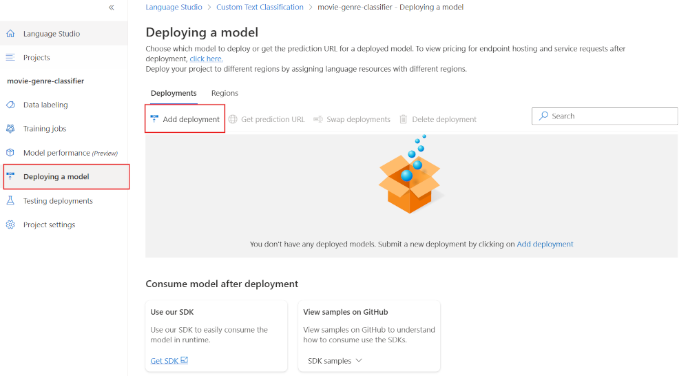
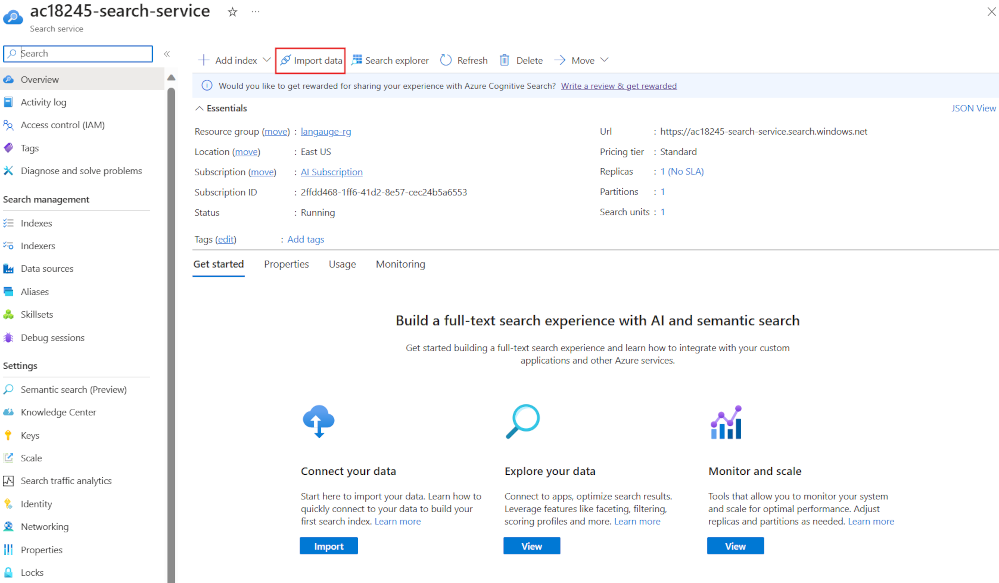
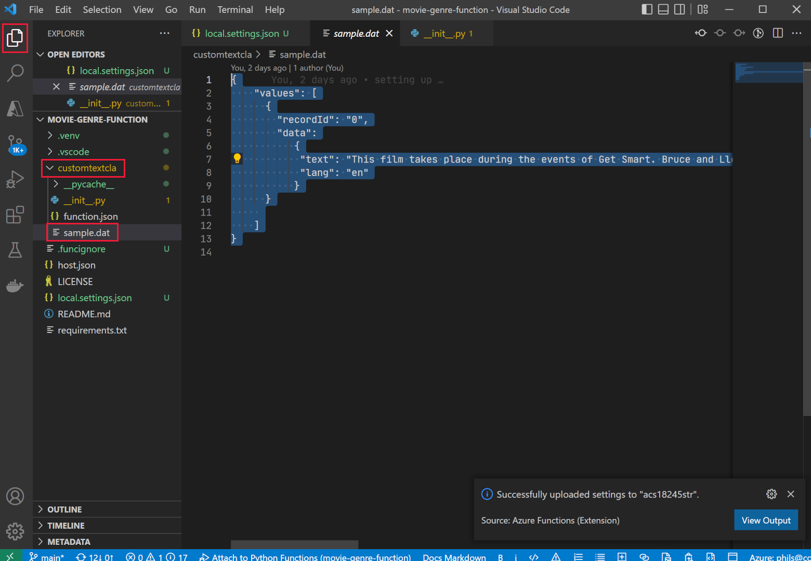
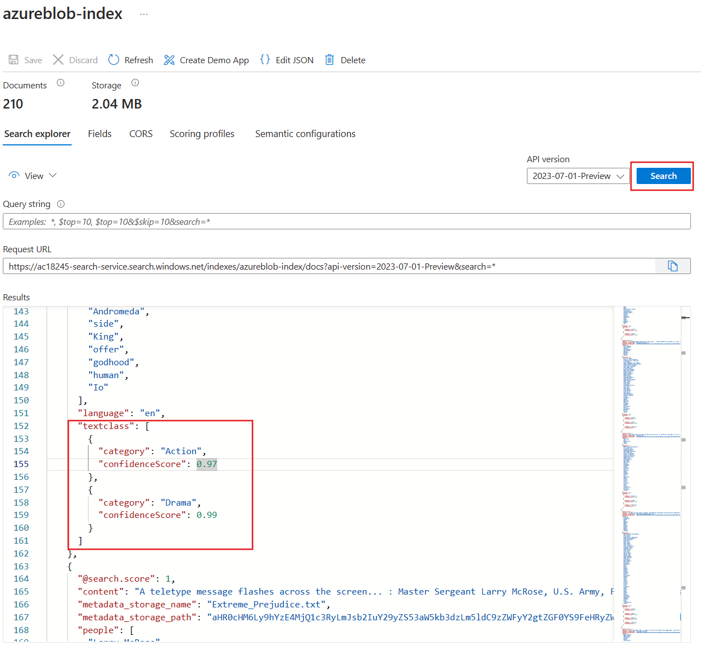

---
lab:
  title: 使用自訂類別來擴充 AI 搜尋索引
---

# 使用自訂類別來擴充 AI 搜尋索引

您已建立搜尋解決方案，接著要新增語言擴充的 Azure AI 服務至索引。

在此練習中，您會建立 Azure AI 搜尋服務解決方案，並使用 Language Studio 自訂文字分類專案的結果，擴充索引。 您會建立函數應用程式，連線搜尋和分類模型。

> **注意** 若要完成此練習，您需要 Microsoft Azure 訂用帳戶。 如果尚未有訂用帳戶，則可在 [https://azure.com/free](https://azure.com/free?azure-portal=true) 註冊免費試用版。

## 使用 Python、VS Code 和 VS Code 延伸模組，設定開發環境

請安裝這些工具完成此練習。 不使用這些工具仍可進行這些步驟。

1. 安裝 [VS Code](https://code.visualstudio.com/)
1. 安裝 [Azure Core Functions Tool](https://github.com/Azure/azure-functions-core-tools)
1. 安裝[適用於 VS Code 的 Azure 工具延伸模組](https://code.visualstudio.com/docs/azure/extensions)
1. 為您的作業系統安裝 [Python 3.8](https://www.python.org/downloads/release/python-380/)。
1. 安裝[適用於 VS Code 的 Python 延伸模組](https://marketplace.visualstudio.com/items?itemName=ms-python.python)

## 設定 Azure 資源

若要節省時間，請選取此 Azure ARM 範本，建立在稍後練習中所需的資源。

### 部署預先組建的 ARM 範本

1. [](https://portal.azure.com/#create/Microsoft.Template/uri/https%3A%2F%2Fraw.githubusercontent.com%2FMicrosoftLearning%2Fmslearn-knowledge-mining%2Fmain%2FLabfiles%2F04-enrich-custom-classes%2Fazuredeploy.json) 選取此連結以建立您的起始資源。 您可能需要將[直接連結](https://portal.azure.com/#create/Microsoft.Template/uri/https%3A%2F%2Fraw.githubusercontent.com%2FMicrosoftLearning%2Fmslearn-knowledge-mining%2Fmain%2FLabfiles%2F04-enrich-custom-classes%2Fazuredeploy.json)複製並貼到搜尋列中。

    
1. 在 [資源群組] 中，選取 [新建]，將群組命名為 **cog-search-language-exe**。********
1. 在 [區域]**** 中，選取靠近您的[支援區域](https://learn.microsoft.com/azure/ai-services/language-service/concepts/regional-support)。
1. **資源前置詞**必須是全域唯一的，請輸入隨機數字和小寫字元前置詞，例如 **acs18245**。
1. 在 [位置]**** 中，選取您在上述步驟選擇的相同區域。
1. 選取 [**檢閱 + 建立**]。
1. 選取 **建立**。

    > **注意** 顯示 **「您必須同意以下的服務條款，才能成功建立此資源」** 錯誤時，請選取 [建立]**** 來表示同意。

1. 選取 [移至資源群組]****，查看您建立的所有資源。

    
您會設定 Azure 認知搜尋索引、建立 Azure 函式，並建立 Language Studio 專案，從電影摘要識別電影內容類型。

### 上傳範例資料訓練語言服務

此練習使用 210 個文字檔，包含電影的情節摘要。 文字檔名稱是電影標題。 資料夾也包含 **movieLabels.json** 檔案，此檔案會對應電影的內容類型至檔案，每個檔案都有如下所示的 JSON 項目：

```json
{
    "location": "And_Justice_for_All.txt",
    "language": "en-us",
    "classifiers": [
        {
            "classifierName": "Mystery"
        },
        {
            "classifierName": "Drama"
        },
        {
            "classifierName": "Thriller"
        },
        {
            "classifierName": "Comedy"
        }
    ]
},
```

1. 瀏覽至 **Labfiles/04-enrich-custom-classes**，並擷取包含所有檔案的 **movies summary.zip** 資料夾。

    > **注意** 您會使用這些檔案在 Language Studio 中訓練模型，也會在 Azure AI 搜尋服務中編製所有檔案的索引。

1. 在 [Azure 入口網站](https://portal.azure.com/)中，選取 [資源群組]****，然後選取您的資源群組。
1. 選取您建立的儲存體帳戶，例如 **acs18245str**。
1. 從左側窗格中選取 [設定]****，針對 [允許 Blob 匿名存取]** 設定選取 [啟用]**** 選項，然後選取頁面頂端的 [儲存]****。

    

1. 從左側選取 [容器]****，然後選取 [+ 容器]****。
1. 在 [新增容器] 窗格的 [名稱] 中，輸入 **language-studio-training-data**。********
1. 在 [匿名存取層級]**** 中，選擇 [容器 (容器和 Blob 的匿名讀取存取權)]****，然後選取 [建立]****。
1. 選取您剛建立的新容器 [language-studio-training-data]。****
    
1. 在窗格頂端，選取 [上傳]。****
1. 在 [上傳 Blob]**** 窗格中，選取 [瀏覽檔案]****。
1. 瀏覽至擷取範例檔案的位置，選取所有文字 (`.txt`) 和 json (`.json`) 檔案。
1. 在窗格中選取 [上傳]。****
1. 關閉 [上傳 Blob] 窗格。****

### 建立語言資源

1. 在頁面頂端的階層連結中，選取 [首頁]****。
1. 選取 [+ 建立資源]****，然後搜尋 [語言服務]**。
1. 選取 [語言服務]**** 底下的 [建立]****。
1. 選取包含**自訂文字分類和自訂具名實體辨識**的選項。
1. 選取 [繼續建立您的資源]。****
1. 在 [資源群組] 中，選擇 [cog-search-language-exe]。********
1. 在 [區域] 中，選取上述步驟使用的區域。****
1. 在 [名稱] 中，輸入 **learn-language-service-for-custom-text**。**** 這必須是全域唯一的，因此您可能需要在其結尾處加上隨機數字或字元。
1. 在 [定價層]，選取 [S]。********
1. 在 [新增/現有的儲存體帳戶] 中，選取 [現有儲存體帳戶]。********
1. 在 [目前選取的訂閱和資源區域中的儲存體帳戶]**** 中，選取您建立的儲存體帳戶，例如 **acs18245str**。
1. 同意**負責任 AI 通知**條款，然後選取 [檢閱 + 建立]。****
1. 選取 **建立**。
1. 等候部署資源，然後選取 [移至資源群組]。****
1. 選取 [learn-language-service-for-custom-text]。****

    
1. 在 [概觀] 窗格向下捲動，然後選取 [開始使用 Language Studio]。********
1. 登入 Language Studio。 如果系統提示您選擇語言資源，請選取您稍早建立的資源。

### 在 Language Studio 中建立自訂文字分類專案

1. 在 Language Studio 首頁上，選取 [新建]，然後選取 [自訂文字分類]。********

    

1. 選取 [下一步]。

    
1. 選取 [多重標籤分類]，然後選取 [下一步]。********

    

1. 在 [名稱]中，輸入 **movie-genre-classifier**。****
1. 在 [文字主要語言] 中，選取 [英文 (美國)]。********
1. 在 [描述] 中，輸入**可從摘要識別電影內容類型的模型**。****
1. 選取 [是，啟用多語言資料集]****。
1. 選取 [下一步]。

    

1. 在 [Blob 儲存體容器] 中，選擇 [language-studio-training-data]。********
1. 選取 [Yes, my documents are already labeled and I have a correctly formatted JSON labels file]\(是，我的文件已加上標籤，並有正確格式化的 JSON 標籤檔案]\)。****
1. 在 [為文件加上標籤] 中，選擇 [movieLabels]。********
1. 選取 [下一步]。
1. 選取**建立專案**。

### 訓練自訂文字分類 AI 模型

1. 在左側，選取 [訓練工作]。****

    

1. 選取 [+ 開始訓練工作]。****

    
1. 在 [訓練新模型] 中，輸入 **movie-genre-classifier**。****
1. 選取**定型**。
1. 訓練分類器模型應該不到 10 分鐘。 等候狀態變更為 [訓練成功]****。

### 部署自訂文字分類 AI 模型

1. 在左側，選取 [部署模型]。****

    
1. 選取 [新增部署]。****

    
1. 在 [建立新的部署名稱] 中，輸入 **test-release**。****
1. 在 [模型] 中，選取 [movie-genre-classifier]。********
1. 選取**部署**。

為稍後的練習保持此網頁開啟。

### 建立 Azure AI 搜尋索引

建立可使用此模型擴充的搜尋索引，您會編製所有文字檔的索引 (包含已下載的電影摘要)。

1. 在 [Azure 入口網站](https://portal.azure.com/)中，依序選取 [資源群組]****、選取您的資源群組，然後選取您所建立的儲存體帳戶，例如 **acs18245str**。
1. 從左側選取 [容器]****，然後選取 [+ 容器]****。
1. 在 [新增容器] 窗格的 [名稱] 中，輸入 **search-data**。********
1. 在 [匿名存取層級]**** 中，選擇 [容器]****。
1. 選取 **建立**。
1. 選取您剛建立的新容器 [search-data]。****
1. 在窗格頂端，選取 [上傳]。****
1. 在 [上傳 Blob]**** 窗格中，選取 [瀏覽檔案]****。
1. 瀏覽至已下載的範例檔案位置，**僅**選取所有文字 (`.txt`) 檔。
1. 在窗格中選取 [上傳]。****
1. 關閉 [上傳 Blob] 窗格。****

### 將文件匯入 Azure AI 搜尋服務

1. 選取左側的 [資源群組]****，選取您的資源群組，然後選取您的搜尋服務。

1. 選取 [匯入資料]。****

    
1. 在 [資料來源] 中，選取 [Azure Blob 儲存體]。********
1. 在 [資料來源名稱] 中，輸入 **movie-summaries**。****
1. 選取 [選擇現有的連線]****，選取您的儲存體帳戶，然後選取您剛建立的容器 [search-data]****。
1. 選取 [新增認知技能 (選用)]****。
1. 展開 [附加 AI 服務]**** 區段，然後選取您稍早建立的 Azure AI 服務。

    
1. 展開 [新增擴充]**** 區段。

    
1. 保留所有欄位的預設值，然後選取 [擷取人員名稱]。****
1. 選取 [擷取關鍵片語]。****
1. 選取 [偵測語言]。****
1. 選取 [下一步: 自訂目標索引]****。

    
1. 保留所有欄位的預設值，針對 **metadata_storage_name** 選取 [可擷取] 和 [可搜尋]。********
1. 選取**下一步：建立索引子**。
1. 選取 [提交]****。

索引子會執行並建立 210 個文字檔的索引。 您不需要等候索引子繼續後續步驟。

## 建立函數應用程式擴充搜尋索引

接著您會建立認知搜尋自訂技能所要呼叫的 Python 函數應用程式。 函數應用程式會使用自訂文字分類器模型，擴充搜尋索引。

1. [下載必要的檔案](https://github.com/MicrosoftLearning/mslearn-knowledge-mining/raw/main/Labfiles/04-enrich-custom-classes/movie-genre-function.zip)，並將包含所有檔案的資料夾解壓縮。
1. 開啟 Visual Studio Code，並開啟您剛才下載的 **movie-genre-function** 資料夾。

    
1. 如果您已安裝所有必要的延伸模組，系統會提示您將專案最佳化。 選取 [是]****。
    
1. 選取 Python 解譯器，解譯器應該是 3.8 版。
1. 工作區將更新，如果系統要求您連線工作區與工作區資料夾，請選取 [是]。****
1. 按 **F5** 開始偵錯應用程式。

    
    如果應用程式已執行，您應該會看到可用於本機測試的 localhost URL。

1. 停止偵錯應用程式，按 **SHIFT** + **F5**。

### 部署本機函數應用程式至 Azure

1. 在 Visual Studio Code 中，按 **F1** 開啟命令選擇區。
1. 在命令選擇區中，搜尋並選取 `Azure Functions: Create Function App in Azure...`。
1. 輸入函數應用程式的全域唯一名稱，例如 **acs13245str-function-app**。
1. 在 [選取執行階段堆疊] 中，選取 [Python 3.8]。********
1. 選取您之前使用的相同位置。

1. 在左側瀏覽，選取 [Azure] 延伸模組。****
    
1. 展開 [資源]****、展開訂用帳戶底下的 [函數應用程式]****，然後以滑鼠右鍵按一下函式，例如 **acs13245-function-app**。
1. 選取 [部署至函數應用程式]。**** 等候應用程式部署完成。
1. 展開應用程式，以滑鼠右鍵按一下 [應用程式設定]，選取 [下載遠端設定]。********
1. 在左側，選取 [總管]，然後選取 [local.settings.json]。********

    
函數應用程式必須連線您的自訂文字分類模型。 請遵循下列步驟，取得組態設定。

1. 在瀏覽器中，瀏覽至 **Language Studio**，您應該會位在 [部署模型] 頁面。****

    
1. 選取您的模型。 然後選取 [取得預測 URL]****。
1. 選取 [預測 URL] 旁的複製圖示。****
1. 在 Visual Studio Code 的 **local.settings.json** 底部，貼上預測 URL。
1. 在 **Language Studio** 的左側，選取 [專案設定]。****

    
1. 選取**主索引鍵**旁的 [複製]圖示。
1. 在 Visual Studio Code 的 **local.settings.json** 底部，貼上主索引鍵。
1. 編輯設定並在底部新增這四行，複製端點至 `TA_ENDPOINT` 值。

    ```json
    ,
    "TA_ENDPOINT": " [your endpoint] ",
    "TA_KEY": " [your key] ",
    "DEPLOYMENT": "test-release",
    "PROJECT_NAME": "movie-genre-classifier"
    ```

1. 複製主索引鍵至 `TA_KEY` 值。

    ```json
    {
      "IsEncrypted": false,
      "Values": {
        "AzureWebJobsStorage": "DefaultEndpointsProtocol=https;AccountName=...",
        "FUNCTIONS_EXTENSION_VERSION": "~4",
        "FUNCTIONS_WORKER_RUNTIME": "python",
        "WEBSITE_CONTENTAZUREFILECONNECTIONSTRING": "DefaultEndpointsProtocol=https;AccountName=...",
        "WEBSITE_CONTENTSHARE": "acs...",
        "APPINSIGHTS_INSTRUMENTATIONKEY": "6846...",
        "TA_ENDPOINT": "https://learn-languages-service-for-custom-text.cognitiveservices.azure.com/language/analyze-text/jobs?api-version=2022-05-01",
        "TA_KEY": "7105e938ce1...",
        "DEPLOYMENT": "test-release",
        "PROJECT_NAME": "movie-genre-classifier"
      }
    }

    ```

    設定應如上所示，並包含專案的值。
 
1. 按 **CTRL**+**S**，儲存 **local.settings.json** 變更。
1. 在左側瀏覽，選取 [Azure] 延伸模組。****
1. 展開 [資源]****、並展開您訂用帳戶底下的 [函數應用程式]****，然後以滑鼠右鍵按一下 [應用程式設定]****，選取 [上傳本機設定]****。

### 測試遠端函數應用程式

您可以使用範例查詢，測試函數應用程式和分類器模型是否正常運作。

1. 在左側，選取 [總管]****，展開 [customtextcla]**** 資料夾，然後選取 [sample.dat]****。

    
1. 複製檔案的內容。
1. 在左側，選取 [Azure 延伸模組]。****

    
1. 在 [函數應用程式] 下，展開 [函式]，以滑鼠右鍵按一下 [customtextcla]，然後選取 [立即執行函式]。****************
1. 在 [輸入要求本文] 中，貼上複製的範例資料，然後按 **Enter**。****

    函式應用程式會以 JSON 結果回應。

1. 展開通知查看整個結果。

    
    JSON 回應應如下所示：

    ```json
    {"values": 
        [
            {"recordId": "0", 
            "data": {"text": 
            [
                {"category": "Action", "confidenceScore": 0.99}, 
                {"category": "Comedy", "confidenceScore": 0.96}
            ]}}
        ]
    }
    ```

### 將欄位新增至搜尋索引

新函數應用程式傳回擴充時需要儲存的位置。 請遵循下列步驟新增複合欄位，儲存文字分類和信賴分數。

1. 在 [Azure 入口網站](https://portal.azure.com/)中，移至包含搜尋服務的資源群組，然後選取您建立的認知搜尋服務，例如 **acs18245-search-service**。
1. 在 [概觀]**** 窗格上，選取 [索引]****。
1. 選取 [azurebob-index]。****
1. 選取 [編輯 JSON]****。
1. 新增欄位至索引，並在內容欄位下貼上下列 JSON。

    ```json
    {
      "name": "textclass",
      "type": "Collection(Edm.ComplexType)",
      "analyzer": null,
      "synonymMaps": [],
      "fields": [
        {
          "name": "category",
          "type": "Edm.String",
          "facetable": true,
          "filterable": true,
          "key": false,
          "retrievable": true,
          "searchable": true,
          "sortable": false,
          "analyzer": "standard.lucene",
          "indexAnalyzer": null,
          "searchAnalyzer": null,
          "synonymMaps": [],
          "fields": []
        },
        {
          "name": "confidenceScore",
          "type": "Edm.Double",
          "facetable": true,
          "filterable": true,
          "retrievable": true,
          "sortable": false,
          "analyzer": null,
          "indexAnalyzer": null,
          "searchAnalyzer": null,
          "synonymMaps": [],
          "fields": []
        }
      ]
    },
    ```

    索引目前應如下所示。

    
1. 選取 [儲存]。

### 編輯自訂技能，呼叫函數應用程式

認知搜尋索引需要填入這些新欄位的方法。 編輯之前建立的技能，並呼叫函數應用程式。

1. 在頁面頂端，選取搜尋服務連結，例如 **acs18245-search-service | Indexes**。

1. 在 [概觀]**** 窗格上，選取 [技能]****。

    
1. 選取 [azureblob-skillset]。****
1. 貼上定義作為第一個技能，即可在下方新增自訂技能定義。

    ```json
    {
      "@odata.type": "#Microsoft.Skills.Custom.WebApiSkill",
      "name": "Genre Classification",
      "description": "Identify the genre of your movie from its summary",
      "context": "/document",
      "uri": "URI",
      "httpMethod": "POST",
      "timeout": "PT30S",
      "batchSize": 1,
      "degreeOfParallelism": 1,
      "inputs": [
        {
          "name": "lang",
          "source": "/document/language"
        },
        {
          "name": "text",
          "source": "/document/content"
        }
      ],
      "outputs": [
        {
          "name": "text",
          "targetName": "class"
        }
      ],
      "httpHeaders": {}
    },
    ```

請變更 `"uri": "URI"`，指向函數應用程式。

1. 在 Visual Studio Code 中，選取 **Azure** 延伸模組。

    
1. 在 [函式] 下，以滑鼠右鍵按一下 [customtextcla]，然後選取 [複製函式 URL]。************
1. 在 Azure 入口網站上，以複製的函式 URI 取代此 URI。 
1. 選取 [儲存]。

### 編輯索引子中的欄位對應

您目前已有可儲存擴充的欄位、呼叫函數應用程式的技能，最後一個步驟是告訴認知搜尋放置擴充的位置。

1. 在頁面頂端，選取搜尋服務，例如 **acs18245-search-service | Skillsets** 連結。

    
1. 在 [概觀]**** 窗格上，選取 [索引子]****。
1. 選取 [azureblob-indexer]。****
1. 選取 [索引子定義 (JSON)]。****
1. 在輸出欄位區段頂端貼上此欄位定義，即可新增輸出欄位對應。

    ```json
    {
      "sourceFieldName": "/document/class",
      "targetFieldName": "textclass"
    },
    ```

    索引子 JSON 定義目前應如下所示：

    
1. 選取 [儲存]。
1. 選取 [重設]，然後選取 [是]。********
1. 選取 [執行]，然後選取 [是]。********

    Azure 認知搜尋服務會執行更新的索引子。 索引子會使用已編輯的自訂技能。 該技能會呼叫函式應用程式以及編製索引的文件。 自訂文字分類器模型會使用文件中的文字，嘗試識別電影的內容類型。 此模型會傳回包含內容類型和信賴等級的 JSON 文件。 索引子使用新的輸出欄位對應，對應 JSON 結果至索引中的欄位。

1. 選取 [執行記錄]。****
1. 檢查索引子是否成功針對 210 份文件執行。

    
    您可能需要選取 [重新整理]，更新索引子的狀態。****

## 測試已擴充的搜尋索引

1. 在頁面頂端，選取搜尋服務，例如 **acs18245-search-service | Indexers**。

1. 在 [概觀]**** 窗格上，選取 [索引]****。
1. 選取 [azurebob-index]。****

    
1. 選取**搜尋**。
1. 探索搜尋結果。

索引中的每份文件都應有可搜尋的新 `textclass` 欄位， 並包含電影內容類型的類別欄位。 可以有多個欄位， 這也顯示出自訂文字分類模型對已識別內容類型的信賴度。

您已完成練習，請刪除所有不再需要的資源。

### 刪除練習資源

1. 在 Azure 入口網站中，移至 [首頁] 頁面，然後選取 [資源群組]****。
1. 選取不需要的資源群組，然後選取 [刪除資源群組]****。
