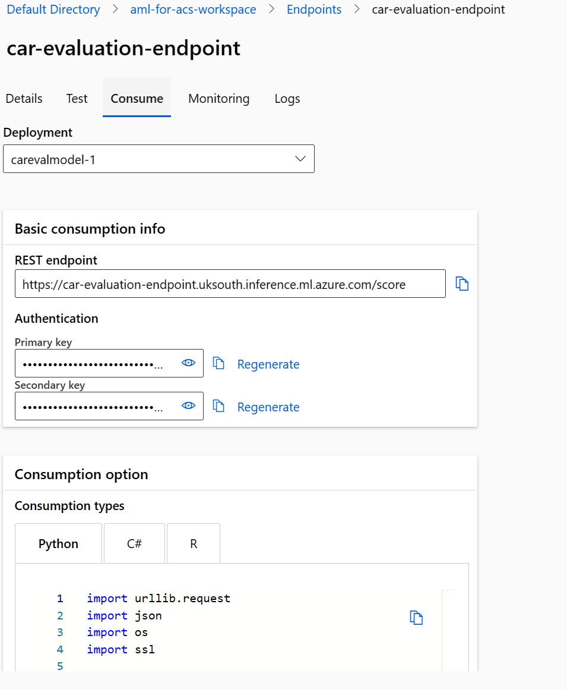

---
lab:
  title: 使用 Azure Machine Learning 模型來豐富搜尋索引
---

# 使用 Azure Machine Learning 模型來豐富搜尋索引

您可以使用機器學習的強大功能來擴充搜尋索引。 若要這樣做，您將使用以 Azure AI Machine Learning 工作室定型的模型，並從機器學習自訂技能集呼叫模型。

在此練習中，您將建立 Azure AI Machine Learning 工作室模型，然後使用模型來定型、部署及測試端點。 然後，您將建立 Azure 認知搜尋服務、建立範例資料，並使用 Azure AI Machine Learning 工作室端點擴充索引。

> **注意** 若要完成此練習，您需要 Microsoft Azure 訂用帳戶。 如果尚未有訂用帳戶，則可在 [https://azure.com/free](https://azure.com/free?azure-portal=true) 註冊免費試用版。
>

## 建立 Azure Machine Learning 工作區

在您擴充搜尋索引之前，請先建立 Azure Machine Learning 工作區。 工作區可讓您存取 Azure AI Machine Learning 工作室，這是可用來建置 AI 模型的圖形化工具，並加以部署以供使用。

1. 登入 [Azure 入口網站](https://portal.azure.com)。
1. 選取 [+ 建立資源]。
1. 搜尋機器學習服務，然後選取 **[Azure Machine Learning]**。
1. 選取 **建立**。
1. 選取 [資源群組]**** 底下的 [新建]****，並將其命名為 **aml-for-acs-enrichment**。
1. 在 [工作區詳細資料] 區段中，針對 [名稱]**** 輸入 **aml-for-acs-workspace**。
1. 選取您附近的支援 [區域]****。
1. 使用**儲存體帳戶**、**金鑰保存庫**、**應用程式深入解析**和**容器登錄**的預設值。
1. 選取 [**檢閱 + 建立**]。
1. 選取 **建立**。
1. 等候部署 Azure Machine Learning 工作區，然後選取 **[移至資源]**。
1. 在 [概觀] 窗格中，選取 **[啟動工作室]**。

## 建立迴歸定型管線

您現在會建立迴歸模型，並使用 Azure AI Machine Learning 工作室管線加以定型。 您將針對汽車價格資料定型模型。 一旦定型模型，就會根據其屬性預測汽車的價格。

1. 在首頁上，選取 [設計工具]****。

1. 從預先建置的元件清單中，選取 **[迴歸 - 汽車價格預測 (基本)]**。

    

1. 選取**驗證**。

1. 在 [圖形驗證]**** 窗格中，選取 [選取提交精靈中的計算目標]**** 錯誤。

    
1. 在 [選取計算類型]**** 下拉式清單中，選擇 [計算執行個體]****。 然後選取下方的 [建立 Azure ML 計算執行個體]****。
1. 在 [計算名稱]**** 欄位中，輸入唯一的名稱 (例如 **compute-for-training**)。
1. 選取 [檢閱 + 建立]****,然後選取 [建立]****。

1. 在 [選取 Azure ML 計算執行個體]**** 欄位中，從下拉式清單中選取您的執行個體。 您可能需要等到佈建完成為止。

1. 再次選取 [驗證]****，管線看起來應該會不錯。

    ![顯示管線外觀良好的螢幕擷取畫面，並醒目提示 [提交] 按鈕。](../media/06-media/submit-pipeline.png)
1. 在 [設定管線作業]**** 窗格中選取 [基本概念]****。
1. 選取 [實驗名稱] 底下的 [新建]****。
1. 在 **[新實驗名稱]** 中，輸入 **[linear-regression-training]**。
1. 選取 [檢閱 + 提交]****，然後選取 [提交]****。

### 建立端點的推斷叢集

當您的管線定型線性迴歸模型時，您可以建立端點所需的資源。 此端點需要 Kubernetes 叢集來處理您模型的 Web 要求。

1. 在左側，選取 **[計算]**。

    
1. 選取 [Kubernetes 叢集]****，然後選取 [+ 新增]****。
1. 在下拉式清單中，選取 [AksCompute]****。
1. 在 [建立 AksCompute]**** 窗格上，選取 [新建]****。
1. 針對 [位置]****，選取您用來建立其他資源的相同區域。
1. 在 VM 大小清單中，選取 [Standard_A2_v2]****。
1. 選取 [下一步]。
1. 在 **[計算名稱]** 中，輸入 **[aml-acs-endpoint]**。
1. 選取 **[啟用 SSL 設定]**。
1. 在 **[分葉網域]** 中，輸入 **[aml-for-acs]**。
1. 選取 **建立**。

### 註冊定型的模型

您的管線作業應該已完成。 您將下載 `score.py` 和 `conda_env.yaml` 檔案。 然後，您將註冊已定型的模型。

1. 選取左側的 [作業]****。

    
1. 選取您的實驗，然後在資料表中選取已完成的作業，例如 [迴歸 - 汽車價格預測 (基本)]****。 如果系統提示您儲存變更，請針對變更選取 [捨棄]****。
1. 在設計工具中，選取右上角的 [作業概觀]****，然後選取 [定型模型]**** 節點。

    
1. 在 [輸出 + 記錄]**** 索引標籤中，展開 [trained_model_outputs]**** 資料夾。
1. 在 `score.py` 旁邊，選取 [更多] 功能表 (**...**)，然後選取 [下載]****。
1. 在 `conda_env.yaml` 旁邊，選取 [更多] 功能表 (**...**)，然後選取 [下載]****。
1. 選取索引標籤頂端的 [+ 註冊模型]****。
1. 在 [作業輸出]**** 欄位中，選取 [trained_model_outputs]**** 資料夾。 然後選取窗格底部的 [下一步]****。
1. 針對模型 [名稱]****，輸入 **carevalmodel**。
1. 在 [描述]**** 中，輸入 [用於預測汽車的價格的線性迴歸模型]****。
1. 選取 [下一步]。
1. 選取**註冊**。

### 編輯評分指令碼，以正確回應 Azure AI 搜尋服務

Azure Machine Learning 工作室已將兩個檔案下載到網頁瀏覽器的預設下載位置。 您必須編輯 score.py 檔案，以變更 JSON 要求和回應的處理方式。 您可以使用文字編輯器或程式碼編輯器，例如 Visual Studio Code。

1. 在您的編輯器中，開啟 score.py 檔案。
1. 取代執行函式的所有內容:

    ```python
    def run(data):
    data = json.loads(data)
    input_entry = defaultdict(list)
    for row in data:
        for key, val in row.items():
            input_entry[key].append(decode_nan(val))

    data_frame_directory = create_dfd_from_dict(input_entry, schema_data)
    score_module = ScoreModelModule()
    result, = score_module.run(
        learner=model,
        test_data=DataTable.from_dfd(data_frame_directory),
        append_or_result_only=True)
    return json.dumps({"result": result.data_frame.values.tolist()})
    ```

    使用此 Python 程式碼:

    ```python
    def run(data):
        data = json.loads(data)
        input_entry = defaultdict(list)
        
        for key, val in data.items():
                input_entry[key].append(decode_nan(val))
    
        data_frame_directory = create_dfd_from_dict(input_entry, schema_data)
        score_module = ScoreModelModule()
        result, = score_module.run(
            learner=model,
            test_data=DataTable.from_dfd(data_frame_directory),
            append_or_result_only=True)
        output = result.data_frame.values.tolist()
        
        return {
                "predicted_price": output[0][-1]
        }    
    ```

    上述變更可讓模式接收具有汽車屬性的單一 JSON 物件，而不是汽車陣列。

    另一項變更是只傳回汽車的預測價格，而不是整個 JSON 回應。
1. 將變更儲存在文字編輯器中。

## 建立自訂環境

接下來，您將建立自訂環境，以便部署至即時端點。

1. 選取瀏覽窗格中的**環境**。
1. 選取 [自訂環境]**** 索引標籤。
1. 選取 **+ 建立**。
1. 針對 [名稱]****，輸入 **my-custom-environment**。
1. 在 [選取環境類型]**** 底下的 [策展環境]** 清單中，選取最新的 **automl-gpu** 版本。
1. 選取 [下一步]。
1. 在您的本機電腦上，開啟您稍早下載的 `conda_env.yaml` 檔案，並複製其內容。
1. 返回瀏覽器，然後在 [自訂] 窗格中選取 [conda_dependencies.yaml]****。
1. 在右側的窗格中，以您稍早複製的程式碼取代其內容。
1. 選取 [下一步]****，然後再次選取 [下一步]****。
1. 選取 [建立]**** 以建立您的自訂環境。

## 使用更新的評分程式碼部署模型 <!--Option for web service deployment is greyed out. Can't go further after trying several different things.-->

您的推斷叢集現在應該已準備好可供使用。 您也已編輯評分程式碼，以處理來自 Azure 認知搜尋自訂技能集的要求。 讓我們建立及測試模型的端點。

1. 在左側，選取 **[模型]**。
1. 選取您註冊的模式 [carevalmodel]****。

1. 選取 [部署]****，然後選取 [即時端點]****。

    ![[選取端點] 窗格的螢幕擷取畫面。](../media/06-media/04-select-endpoint.png)
1. 針對 [名稱]****，輸入唯一的名稱，例如 **car-evaluation-endpoint-1440637584**。
1. 針對 [計算類型]****，選取 [受控]****。
1. 針對 [驗證類型]****，選取 [金鑰型驗證]****。
1. 選取 [下一步]****，然後選取 [下一步]****。
1. 再次選取 [下一步]。
1. 在 [選取用於推斷的評分指令碼]**** 欄位中，瀏覽至更新的 `score.py` 檔案並加以選取。
1. 在 [選取環境類型]**** 下拉式清單中，選取 [自訂環境]****。
1. 從清單中選取自訂環境上的核取方塊。
1. 選取 [下一步]。
1. 針對 [虛擬機器]，選取 [Standard_D2as_v4]****。
1. 將 [執行個體計數]**** 設為 **1**。
1. 選取 [下一步]****，然後再次選取 [下一步]****。
1. 選取 **建立**。

等候模型部署，最多可能需要 10 分鐘的時間。 您可以在 [通知]**** 或 Azure Machine Learning 工作室的 [端點] 區段中檢查狀態。

### 測試定型模型的端點

1. 在左側，選取 **[端點]**。
1. 選取 **[car-evaluation-endpoint]**。
1. 選取 [測試]****，在 [輸入資料以測試端點]**** 中，貼上此範例 JSON。

    ```json
    {
        "symboling": 2,
        "make": "mitsubishi",
        "fuel-type": "gas",
        "aspiration": "std",
        "num-of-doors": "two",
        "body-style": "hatchback",
        "drive-wheels": "fwd",
        "engine-location": "front",
        "wheel-base": 93.7,
        "length": 157.3,
        "width": 64.4,
        "height": 50.8,
        "curb-weight": 1944,
        "engine-type": "ohc",
        "num-of-cylinders": "four",
        "engine-size": 92,
        "fuel-system": "2bbl",
        "bore": 2.97,
        "stroke": 3.23,
        "compression-ratio": 9.4,
        "horsepower": 68.0,
        "peak-rpm": 5500.0,
        "city-mpg": 31,
        "highway-mpg": 38,
        "price": 0.0
    }
    ```

1. 選取 [測試]****，您應該會看到回應：

    ```json
    {
        "predicted_price": 5852.823214312815
    }
    ```

1. 選取 **[取用]**。

    
1. 複製 **[REST 端點]**。
1. 複製 **[主索引鍵]**。

### 整合 Azure Machine Learning 模型與 Azure AI 搜尋服務

接下來，您會建立新的認知搜尋服務，並使用自訂技能擴充索引。

### 建立測試檔案

1. 在 [Azure 入口網站](https://portal.azure.com/learn.docs.microsoft.com?azure-portal=true)，中選取 [資源群組]。
1. 選取 **[aml-for-acs-enrichment]**。

    
1. 選取儲存體帳戶，例如 **amlforacsworks1440637584**。
1. 在 [設定]**** 下方，選取 [設定]****。 然後將 [允許 Blob 匿名存取]**** 設定為 [已啟用]****。
1. 選取 [儲存]。
1. 在 [資料儲存體] 下選取 [容器]。 
1. 建立新的容器來儲存索引資料，選取 **[+ 容器]**。
1. 在 **[新增容器]** 窗格的 **[名稱]** 中，輸入 **[docs-to-search]**。
1. 在 [匿名存取層級]**** 中，選取 [容器 (容器和 Blob 的匿名讀取存取權)]****。
1. 選取 **建立**。
1. 選取您建立的 **docs-to-search** 容器。
1. 在文字編輯器中，建立 JSON 文件:

    ```json
    {
      "symboling": 0,
      "make": "toyota",
      "fueltype": "gas",
      "aspiration": "std",
      "numdoors": "four",
      "bodystyle": "wagon",
      "drivewheels": "fwd",
      "enginelocation": "front",
      "wheelbase": 95.7,
      "length": 169.7,
      "width": 63.6,
      "height": 59.1,
      "curbweight": 2280,
      "enginetype": "ohc",
      "numcylinders": "four",
      "enginesize": 92,
      "fuelsystem": "2bbl",
      "bore": 3.05,
      "stroke": 3.03,
      "compressionratio": 9.0,
      "horsepower": 62.0,
      "peakrpm": 4800.0,
      "citympg": 31,
      "highwaympg": 37,
      "price": 0
    }
    ```

    將文件儲存到您的電腦作為 `test-car.json` 擴充功能。
1. 在入口網站中，選取 **[上傳]**。
1. 在 [上傳 Blob]**** 窗格中，選取 [瀏覽檔案]****，瀏覽至您儲存 JSON 文件的位置，然後加以選取。
1. 選取**上傳**。

### 建立 Azure AI 搜尋服務資源

1. 在 Azure 入口網站的首頁上，選取 [+ 建立資源]****。
1. 搜尋 **Azure AI 搜尋服務**，然後選取 [Azure AI 搜尋服務]****。
1. 選取 **建立**。
1. 在 **[資源群組]** 中，選取 **[aml-for-acs-enrichment]**。
1. 在 [服務名稱] 中，輸入唯一的名稱，例如 **acs-enriched-1440637584**。
1. 針對 [位置]****，選取與上方所用相同的區域。
1. 選取 [檢閱 + 建立]****,然後選取 [建立]****。
1. 等候部署資源，然後選取 **[移至資源]**。
1. 選取 [匯入資料]。****
1. 在 [連接到您的資料]**** 窗格中，針對 [資料來源]**** 欄位，選取 [Azure Blob 儲存體]****。
1. 在 [資料來源名稱]**** 中，輸入 **import-docs**。
1. 在 **[剖析模式]** 中，選取 **[JSON]**。
1. 在 **[連接字串]** 中，選取 **[選擇現有的連線]**。
1. 選取您上傳至的儲存體帳戶，例如 **amlforacsworks1440637584**。
1. 在 **[容器]** 窗格中，選取 **[docs-to-search]**。 
1. 選取**選取**。
1. 選取 [下一步：新增認知技能 (選用)]****。

### 新增認知技能

1. 展開 **[新增擴充]**，然後選取 **[擷取人員名稱]**。
1. 選取 [下一步: 自訂目標索引]****。
1. 選取 [+ 新增欄位]****，在清單底部的 [欄位名稱]**** 中輸入 **predicted_price**。
1. 在 [類型]**** 中，為您的新項目選取 [Edm.Double]****。
1. 針對所有欄位選取 **[可擷取]**。
1. 針對 [製造商]**** 選取 [可搜尋]****。
1. 選取**下一步：建立索引子**。
1. 選取 [提交]****。

## 將 AML 技能新增至技能集

您現在會將人員名稱擴充取代為 Azure Machine Learning 自訂技能集。

1. 在 [概觀] 窗格中，選取 [搜尋管理]**** 底下的 [技能]****。
1. 在 **[名稱]** 底下，選取 **[azureblob-skillset]**。
1. 以這個 JSON 取代 `EntityRecognitionSkill` 的技能定義，請記得取代複製的端點和主索引鍵值:

    ```json
    "@odata.type": "#Microsoft.Skills.Custom.AmlSkill",
    "name": "AMLenricher",
    "description": "AML studio enrichment example",
    "context": "/document",
    "uri": "PASTE YOUR AML ENDPOINT HERE",
    "key": "PASTE YOUR PRIMARY KEY HERE",
    "resourceId": null,
    "region": null,
    "timeout": "PT30S",
    "degreeOfParallelism": 1,
    "inputs": [
      {
        "name": "symboling",
        "source": "/document/symboling"
      },
      {
        "name": "make",
        "source": "/document/make"
      },
      {
        "name": "fuel-type",
        "source": "/document/fueltype"
      },
      {
        "name": "aspiration",
        "source": "/document/aspiration"
      },
      {
        "name": "num-of-doors",
        "source": "/document/numdoors"
      },
      {
        "name": "body-style",
        "source": "/document/bodystyle"
      },
      {
        "name": "drive-wheels",
        "source": "/document/drivewheels"
      },
      {
        "name": "engine-location",
        "source": "/document/enginelocation"
      },
      {
        "name": "wheel-base",
        "source": "/document/wheelbase"
      },
      {
        "name": "length",
        "source": "/document/length"
      },
      {
        "name": "width",
        "source": "/document/width"
      },
      {
        "name": "height",
        "source": "/document/height"
      },
      {
        "name": "curb-weight",
        "source": "/document/curbweight"
      },
      {
        "name": "engine-type",
        "source": "/document/enginetype"
      },
      {
        "name": "num-of-cylinders",
        "source": "/document/numcylinders"
      },
      {
        "name": "engine-size",
        "source": "/document/enginesize"
      },
      {
        "name": "fuel-system",
        "source": "/document/fuelsystem"
      },
      {
        "name": "bore",
        "source": "/document/bore"
      },
      {
        "name": "stroke",
        "source": "/document/stroke"
      },
      {
        "name": "compression-ratio",
        "source": "/document/compressionratio"
      },
      {
        "name": "horsepower",
        "source": "/document/horsepower"
      },
      {
        "name": "peak-rpm",
        "source": "/document/peakrpm"
      },
      {
        "name": "city-mpg",
        "source": "/document/citympg"
      },
      {
        "name": "highway-mpg",
        "source": "/document/highwaympg"
      },
      {
        "name": "price",
        "source": "/document/price"
      }
    ],
    "outputs": [
      {
        "name": "predicted_price",
        "targetName": "predicted_price"
      }
    ]  
    ```

1. 選取 [儲存]。

### 更新輸出欄位對應

1. 返回 [概觀]**** 窗格，接著選取 [索引子]****，然後選取 [azureblob-indexer]****。
1. 選取 [索引子定義 (JSON)]**** 索引標籤，然後將 **outputFieldMappings** 值變更為：

    ```json
    "outputFieldMappings": [
        {
          "sourceFieldName": "/document/predicted_price",
          "targetFieldName": "predicted_price"
        }
      ]
    ```

1. 選取 [儲存]。
1. 選取 [重設]，然後選取 [是]。********
1. 選取 [執行]，然後選取 [是]。********

## 測試索引擴充

更新的技能集現在會將預測值新增至索引中的測試汽車文件。 若要測試該項目，請遵循下列步驟。

1. 在搜尋服務的 [概觀]**** 窗格上，選取窗格頂端的 [搜尋總管]****。
1. 選取**搜尋**。
1. 捲動到結果底部。
    
您應該會看到填入欄位 `predicted_price`。

## 刪除練習資源

您已完成練習，請刪除所有不再需要的資源。 刪除 Azure 資源:

1. 在 **Azure 入口網站**，中選取 [資源群組]。
1. 選取不需要的資源群組，然後選取 [刪除資源群組]****。
