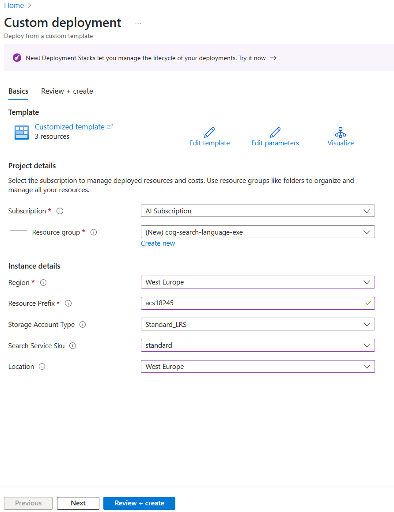

---
lab:
  title: 使用推送 API 新增至索引
---

# 使用推送 API 新增至索引

您想要探索如何使用 C# 程式碼建立 Azure AI 搜尋服務索引，並將文件上傳至該索引。

在此練習中，您會複製現有的 C# 解決方案並執行，以找出上傳文件的最佳批次大小。 然後使用此批次大小，並使用執行緒方法有效地上傳文件。

> **注意** 若要完成此練習，您需要 Microsoft Azure 訂用帳戶。 如果尚未有訂用帳戶，則可在 [https://azure.com/free](https://azure.com/free?azure-portal=true) 註冊免費試用版。

## 設定 Azure 資源

若要節省時間，請選取此 Azure Resource Manager 範本，建立在稍後練習中所需的資源：

1. [將資源部署至 Azure](https://portal.azure.com/#create/Microsoft.Template/uri/https%3A%2F%2Fraw.githubusercontent.com%2FMicrosoftLearning%2Fmslearn-knowledge-mining%2Fmain%2FLabfiles%2F07-exercise-add-to-index-use-push-api%20lab-files%2Fazuredeploy.json) - 選取此連結以建立您的 Azure AI 資源。
    
1. 在 [資源群組] 中，選取 [新建]，將群組命名為 **cog-search-language-exe**。********
1. 在 [區域]**** 中，選取靠近您的[支援區域](/azure/ai-services/language-service/custom-text-classification/service-limits#regional-availability)。
1. **資源前置詞**必須是全域唯一的，請輸入隨機數字和小寫字元前置詞，例如 **acs118245**。
1. 在 [位置]**** 中，選取您在上述步驟選擇的相同區域。
1. 選取 [**檢閱 + 建立**]。
1. 選取 **建立**。
1. 當部署完成時，選取 [移至資源群組]**** 以查看您建立的所有資源。

    

## 複製 Azure AI 搜尋服務 REST API 資訊

1. 在資源清單中，選取您建立的搜尋服務。 在上述範例中，即 **acs118245-search-service**。
1. 將搜尋服務名稱複製到文字檔中。

    
1. 在左側，選取 [金鑰]****，然後將**主要系統管理金鑰**複製到相同的文字檔中。

## 下載 Visual Studio Code 中使用的範例程式碼

您將使用 Visual Studio Code 執行 Azure 範例程式碼。 程式碼檔案已在 GitHub 存放庫中提供。

1. 啟動 Visual Studio Code。
1. 開啟選擇區 (SHIFT+CTRL+P) 並執行 **Git：複製 ** 命令，將 `https://github.com/MicrosoftLearning/mslearn-knowledge-mining` 存放庫複製到本機資料夾 (哪個資料夾無關緊要)。
1. 複製存放庫後，請在 Visual Studio Code 中開啟此資料夾。
1. 等候其他檔案安裝以支援存放庫中的 C# 程式碼專案。

    > **注意**：如果系統提示您新增必要的資產來組建和偵錯，請選取 [現在不要]****。

1. 在左側導覽中，展開 **optimize-data-indexing/v11/OptimizeDataIndexing** 資料夾，然後選取 **appsettings.json** 檔案。

    
1. 貼上您的搜尋服務名稱和主要管理金鑰。

    ```json
    {
      "SearchServiceUri": "https://acs118245-search-service.search.windows.net",
      "SearchServiceAdminApiKey": "YOUR_SEARCH_SERVICE_KEY",
      "SearchIndexName": "optimize-indexing"
    }
    ```

    設定檔案看起來應該會像上面這樣。
1. 按 **CTRL + S** 儲存變更。
1. 以滑鼠右鍵按一下 **OptimizeDataIndexing** 資料夾，然後選取 [在整合式終端中開啟]****。
1. 在終端中，輸入 `dotnet run`，然後按 **Enter**。

    
輸出內容會顯示在此情況下，最佳效能的批次大小是 900 份文件。 每秒達到 6.071 MB 時。

## 編輯程式碼以實作執行緒和輪詢並重試策略

程式碼已加上註解，可讓應用程式變更為使用執行緒將文件上傳至搜尋索引。

1. 請確定您已選取 **Program.cs**。

    
1. 將第 37 行和 38 行註解如下：

    ```csharp
    //Console.WriteLine("{0}", "Finding optimal batch size...\n");
    //await TestBatchSizesAsync(searchClient, numTries: 3);
    ```

1. 取消註解第 44 到 48 行。

    ```csharp
    Console.WriteLine("{0}", "Uploading using exponential backoff...\n");
    await ExponentialBackoff.IndexDataAsync(searchClient, hotels, 1000, 8);

    Console.WriteLine("{0}", "Validating all data was indexed...\n");
    await ValidateIndexAsync(indexClient, indexName, numDocuments);
    ```

    控制批次大小和執行緒數目的程式碼為 `await ExponentialBackoff.IndexDataAsync(searchClient, hotels, 1000, 8)`。 批次大小為 1000，且執行緒為 8。

    
    您的程式碼看起來應會如上所示。

1. 若要儲存變更，請按 **Ctrl**+**S**。
1. 選取您的終端，然後按下任何按鍵以結束執行中的程序 (如果您尚未結束)。
1. 在終端中執行 `dotnet run`。

    應用程式會啟動八個執行緒，然後在每個執行緒完成將新訊息寫入主控台的作業時：

    ```powershell
    Finished a thread, kicking off another...
    Sending a batch of 1000 docs starting with doc 57000...
    ```

    上傳 100,000 份文件之後，應用程式會撰寫摘要 (這可能需要一些時間才能完成)：

    ```powershell
    Ended at: 9/1/2023 3:25:36 PM
    
    Upload time total: 00:01:18:0220862
    Upload time per batch: 780.2209 ms
    Upload time per document: 0.7802 ms
    
    Validating all data was indexed...
    
    Waiting for service statistics to update...
    
    Document Count is 100000
    
    Waiting for service statistics to update...
    
    Index Statistics: Document Count is 100000
    Index Statistics: Storage Size is 71453102
    
    ``````

探索 `TestBatchSizesAsync` 程序中的程式碼，以查看程式碼如何測試批次大小效能。

探索 `IndexDataAsync` 程序中的程式碼，以查看程式碼如何管理執行緒。

探索 `ExponentialBackoffAsync` 中的程式碼，以查看程式碼如何實作指數輪詢重試策略。

您可以搜尋並確認文件是否已新增至 Azure 入口網站中的索引。


## 清理

您已完成練習，請刪除所有不再需要的資源。 請從複製到您電腦的程式碼開始。 接著，請刪除 Azure 資源。

1. 在 **Azure 入口網站**，中選取 [資源群組]。
1. 選取您為此練習建立的資源群組。
1. 選取 [刪除資源群組]****。 
1. 確認刪除，然後選取 [刪除]****。
1. 選取您不需要的資源，然後選取 [刪除]****。
