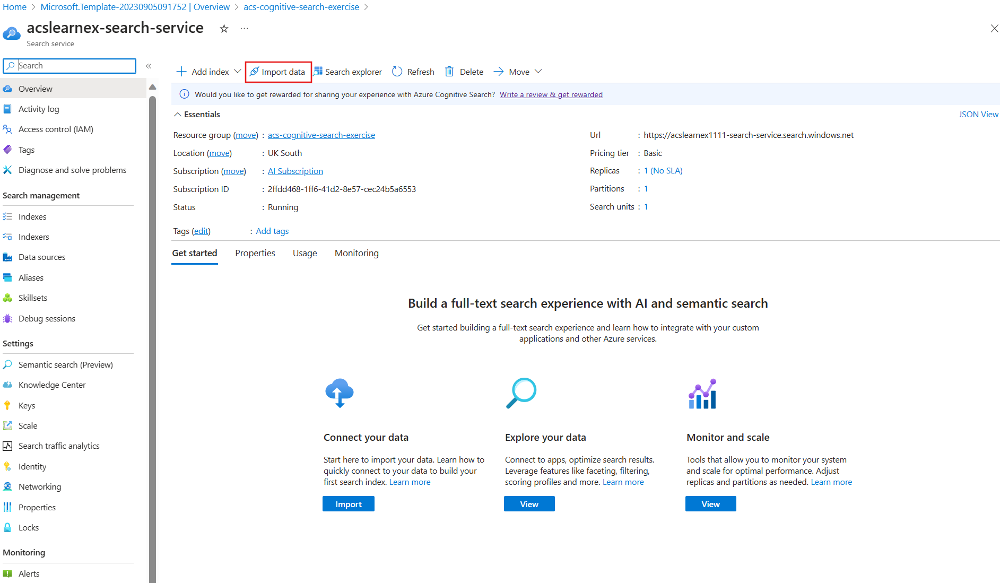

---
lab:
  title: 偵錯搜尋問題
---

# 偵錯搜尋問題

您建立好自己的搜尋解決方案後，發現索引子上出現一些警告。

在本練習中，您會建立 Azure AI 搜尋服務解決方案、匯入樣本資料，然後解析索引子上的警告。

> **注意**：若要完成此練習，您需要 Microsoft Azure 訂用帳戶。 如果尚未有訂用帳戶，則可在 [https://azure.com/free](https://azure.com/free?azure-portal=true) 註冊免費試用版。

## 建立自己的搜尋解決方案

開始使用偵錯工作階段之前，請先建立 Azure 認知搜尋服務。

1. [將資源部署至 Azure](https://portal.azure.com/#create/Microsoft.Template/uri/https%3A%2F%2Fraw.githubusercontent.com%2FAzure-Samples%2Fazure-search-knowledge-mining%2Fmain%2Fazuredeploy.json) - 選取此連結，將所有需要的資源部署至 Azure 入口網站。

    

1. 在 [資源群組]**** 下，選取 [新建]****。
1. 輸入 **acs-cognitive-search-exercise**。
1. 選取與您最接近的 [區域]****。
1. 針對 [資源前置詞]****，輸入 **acslearnex**，並新增隨機的數字或字元組合，以確保儲存體名稱是唯一的。
1. 針對 [位置]，選取與上方所用相同的區域。
1. 在窗格底部，選取 [審核 + 建立]****。
1. 等候資源部署完成，然後選取 [前往資源群組]****。

## 匯入樣本資料

資源建立完成之後，即可匯入來源資料。

1. 在列出的資源中，選取搜尋服務。

1. 在 [概觀]**** 窗格上，選取 [匯入資料]****。

      

1. 在匯入資料窗格的 [資料來源] 中，選取 [樣本]****。

      

1. 在樣本清單中選取 [hotels-sample]****。
1. 選取 [下一步：新增認知技能 (選用)]****。
1. 展開 [新增擴充]**** 區段。

    

1. 選取 [文字認知技能]****。
1. 選取 [下一步：自訂目標索引]****。
1. 保留預設值，然後選取 [下一步：建立索引子]****。
1. 選取 [提交]****。

## 使用偵錯工作階段解析索引子上的警告

索引子即將開始內嵌 50 份文件。 但檢查索引子的狀態後，您卻發現有警告。

1. 選取左窗格中的 [偵錯工作階段]****。

1. 選取 [+ 新增偵錯工作階段]****。

1. 針對儲存體連接字串選取 [選擇現有的連線]****，然後選取您的儲存體帳戶。

    
1. 選取 [+ 容器]**** 來新增新容器。 將其命名為 **acs-debug-storage**。

    

1. 將其 [匿名存取層級]**** 設定為 [容器 (容器和 Blob 的匿名讀取存取)]****。

    > **注意**：您可能需要啟用 Blob 匿名，才能選取此選項。 若要這樣做，請在儲存體帳戶中移至 [設定]****，將 [允許 Blob 匿名存取]**** 設定為 [啟用]****，然後選取 [儲存]****。

1. 選取 **建立**。
1. 在清單中選取您的新容器，然後選取 [選取]****。
1. 針對 [索引子範本]**** 選取 [hotel-sample-indexer]****。
1. 選取 [儲存工作階段]****。

    相依性關係圖顯示每份文件都有三項技能方面的錯誤。
    

1. 選取 [V3]****。
1. 在技能詳細資料窗格上選取 [錯誤/警告 (1)]****。
1. 展開 [訊息]**** 資料行檢視詳細資料。

    詳細資料如下︰

    *無效的語言代碼 '(未知)'。支援的語言：ar、cs、da、de、en、es、fi、fr、hu、it、ja、ko、nl、no、pl、pt-BR、pt-PT、ru、sv、tr、zh-Hans。如需其他詳細資訊，請參閱 https://aka.ms/language-service/language-support。*

    請回顧相依性關係圖，語言偵測技能輸出至三項技能時顯示警告。 另外，`languageCode` 則是造成錯誤的技能輸入。

1. 在相依性關係圖中選取 [語言偵測]****。

    
    請查看技能設定 JSON，您會發現用來推算語言的欄位為 `HotelId`。

    由於技能無法解析使用識別碼的語言，因此本欄位造成了錯誤。

## 解析索引子上的警告

1. 選取 [輸入] 底下的 [來源]****，並將欄位變更為 `/document/Description`。
    
1. 選取 [儲存]。
1. 選取**執行**。

    

    索引子上應該不會再顯示任何錯誤或警告。 現在請更新技能。

1. 選取 [認可變更...]****

    
1. 選取 [確定]。

1. 現在您需要確定您的技能集已連結至 Azure AI 服務資源，否則您會達到基本配額且索引子會逾時。 若要執行此操作，請在左窗格中選取 [技能集]****，然後選取您的 [hotels-sample-skillset]****。

    
1. 選取 [連線 AI 服務]****，然後選取清單中的 AI 服務資源。

    
1. 選取 [儲存]。

1. 現在請執行索引子，以固定 AI 擴充來更新文件。 若要執行此操作，請在左窗格中選取 [索引子]****，選取 [hotels-sample-indexer]****，然後選取 [執行]****。  完成執行後，您應該不會再看到任何警告。

    

> [!TIP]
> 完成練習之後，如果您已完成探索 Azure AI 搜尋服務，請刪除您在練習中建立的 Azure 資源。 最簡單的方式是刪除 **acs-cognitive-search-exercise** 資源群組。
